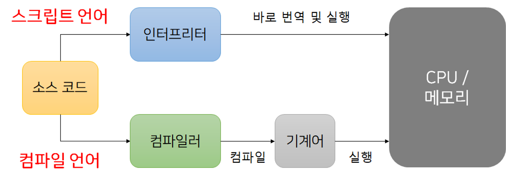

# Javascript
## Authored by Jungeun Pyun

모던 자바스크립트 입문 서적으로 기반으로 스터디한 내용을 담고있습니다. 스터디 진행에 따라 지속적으로 업데이트 예정입니다.

---

### 1장 자바스크립트의 개요 & 3장 변수와 값

컴퓨터는 기본적으로 기계어만 이해할 수 있다. 하지만 기계어를 사람이 이해하기는 쉽지 않다. 따라서 **프로그래밍 언어**는 사람이 이해할 수 있는 언어로 프로그램을 작성하고 그 프로그램을 기계어로 번역해서 컴퓨터가 실행될 수 있도록 한다.

프로그래밍 언어엔 두 종류가 있다. **컴파일 언어**와 **인터프리터 언어**. 코드를 실행하기 이전에 기계어로 모두 번역하고 번역된 실행파일을 한 번에 CPU에 로드하는 것이 컴파일 언어이다. 대표적으로 C, C++, 자바 등이 있다.

하지만 인터프리터 언어는 프로그램을 한 줄마다 기계어로 번역해서 실행하는 프로그래밍 언어이다. 대표적으로 파이썬 루비 그리고 자바스크립트 등이 있다. 넓은 범위로 브라우저, 엔진 등 모든 것이 인터프리터라고 볼 수 있다.

컴파일 언어가 컴파일 하는데 시간은 걸리지만 실행 속도는 더 빠르다. 줄 단위로 번역 및 실행되는 인터프리터는 컴파일 언어보단 실행 속도가 느리다.

     

1\. 자바스크립트의 특징

-   **인터프리터 언어**이다. 프로그램을 한줄씩 기계어로 번역해서 실행하는 언어로서 기존엔 컴파일 언어와 비교하여 실행 속도가 느렸지만 최근 웹 브라우저 대부분에 실행 시간에 자바스크립트 코드를 컴파일하는 JIT 컴파일러(Just In Time Compiler)가 내장되어 실행 속도가 매우 빨라졌다.
-   **동적 프로토타입 기반 객체 지향 언어**이다. 기존의 객체를 복사하여 새로운 객체를 생성하는 프로토타입을 기반으로 프로퍼티와 메서드를 동적으로 추가 및 삭제가 가능하다.
-   **동적 타입 언어**이다. 변수의 타입이 없고 동적으로 변화한다.
-   **함수가 일급 객체**이다. 함수가 객체이며 함수에 함수를 인수로 넘길 수 있다. 자바스크립트는 객체 지향 언어지만, 함수형 언어의 특징을 가진다. 즉, 처리와 관련된 데이터와 절차를 하나로 묶어서 객체 단위로 관리를 하기도 하지만 프로그램을 함수를 조합하여 구현하기도 한다는 의미다.
-   **함수가 클로저를 정의**한다.

2\. ECMAScript

-   자바스크립트는 ECMA (Ecma International) 라는 조직에서 표준화한 코어 언어이다.
-   초창기 자바스크립트와 브라우저의 호환성이 매우 낮았으나, ECMAScript 표준화가 진행되면서 호환성 문제가 해결되었다.

---

**변수란,** 메모리에 일정한 크기의 영역으로 생성하여 값을 담는 상자를 의미한다.

변수를 선언하지 않은 상태에서 값을 대입하면 자동으로 전역 변수 선언이 된다. 하지만 해당 방식은 코드 작성에 혼란을 줄 수 있기 때문에 추천하지 않는다.

**선언과 할당(초기화)은 다른 의미이다!** 아래의 선언자 종류를 확인할 때 유의해야 한다.

-   var : 함수 단위 스코프로 전역변수로 사용된다. (함수 내 선언 : 지역변수 / 함수 외 선언 : 전역 변수)
-   let : 선언 후 재 할당이 가능한 변수이다. (스코프 범위로 나뉘어서 사용됨) / 재할당은 가능하지만 재선언은 불가하다. (에러 발생)
-   const : 선언  후  재할당이  불가하다.선언과  동시에  초기화(할당) 해야한다!

**호이스팅(hosting) / 끌어올림**

-   스크립트 중반부에서 변수 선언을 하더라도 스크립트 첫머리에서 선언한 것처럼 된다.

데이터 타입

-   원시 타입 : Number, String, Boolean, Undefined, null, Symbol
-   객체 타입

**이때, undefined와 null은 다른 데이터 타입이다.**

-   null : 값이 비어있는 변수 (type : object)
-   undefined : 정의되어 있지 않은 값 (type : undefined)

블로그링크 : <https://jungeunpyun.tistory.com/44>
